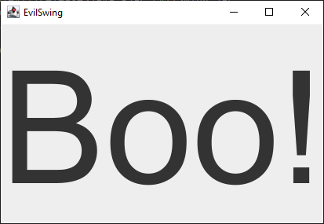

# EvilSwing
EvilSwing is a simple jar file that displays a JFrame with `Boo!`. It's created
to mimic a backdoored jar file.

## Building
Run `gradlew bigjar` and see the newly built `release/EvilSwing.jar`.

## Running
Run `java -jar EvilSwing.jar` to see the thingie.

## License
MIT, see [LICENSE](LICENSE) for details.